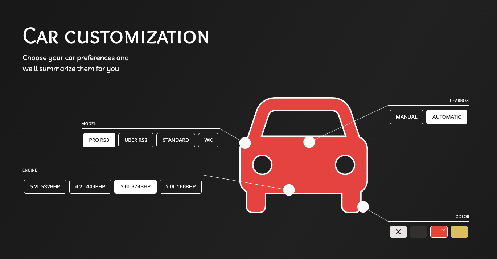

# Car customization app

- [Car customization app](#car-customization-app)
  - [Running locally](#running-locally)
  - [Used technologies](#used-technologies)
  - [Part structure](#part-structure)
  - [Expanding functionalities](#expanding-functionalities)
  - [Author and license](#author-and-license)



## Running locally

To run project locally clone this repository

`git clone https://github.com/filipw01/car-customization`

Install dependencies

`npm install`

And simply run dev environment

`npm run dev`

By default app will run on `localhost:3000`

## Used technologies

App is created with Next.js and hosted on Vercel. Next.js provides both API endpoint and SSR for React app.
Animations are created with FramerMotion

## Part structure

Everything in car is a car part including it's model.

```json
{
  "id": 7,
  "name": "5.2L 532BHP",
  "dependencies": [[1, 2], 6],
  "price": 13.99,
  "type": "engine"
},
```
Each car part must provide `id`, `name`, `price` and `type`.

Color as a part type has on additional requirement `hexValue` and it's in form of `#ffffff`

`dependencies` are optional and have form of 
- `[1, 2]` - must have both part with id 1 and 2
- `[[1, 2]]` - must have both part with id 1 or 2
- `[[1, 2], 3]` - must have both part with id (1 or 2) and 3

## Expanding functionalities

Adding new parts and it's dependencies is not a problem. Just add it to `data.json`.

To maintain complex layout adding another part type requires adding new CarComponent to Car

## Author and license

Author: Filip Wachowiak
License: MIT